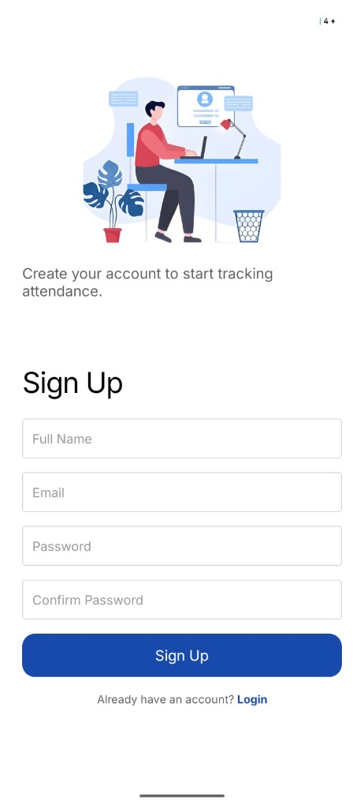
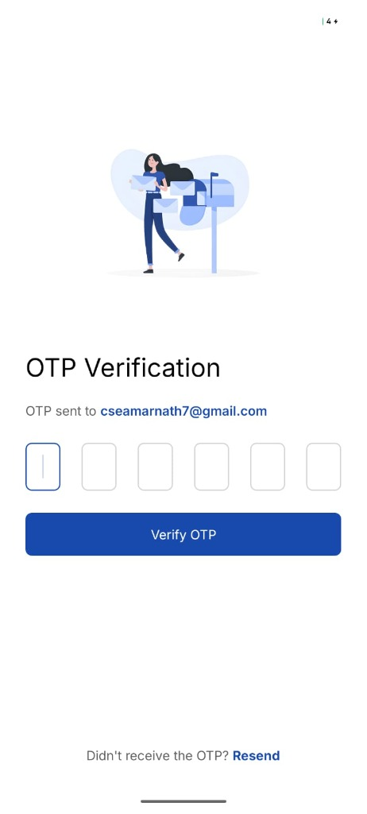
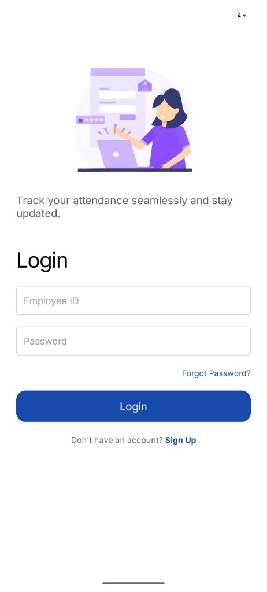

# Attendance Management Application

## Overview

This project is a full-stack attendance management application built using **React Native (Expo)** for the frontend and **Node.js with Express** for the backend. The application enables employees to register, log in securely, and track their daily attendance through a simple clock-in and clock-out system.

The backend uses **Firebase Firestore** for data storage, while **Email OTP verification** and **JWT authentication** ensure secure access to the system.

---

## 📱 Download App

You can download the latest Android APK for this application here:
- [Download Attendo APK](./releases/attendo-app.apk)

---

## 📸 Screenshots

<p align="center">
  
  
  
  
</p>

---

## Features

### User Registration
- Register using name, email address, and password.
- Automatically generates a unique Employee ID (e.g., `EMP123456`).
- Sends an OTP to the registered email address for account verification.

### Secure Login
- Login using Employee ID and password.
- Sends a new OTP to the registered email for verification.
- Grants access only after successful OTP validation.

### Attendance Management
- Clock In to start a work session.
- Clock Out to end the session.
- Automatically calculates and stores working duration.

### Dashboard
- View current attendance status.
- Access complete attendance history.
- Track previous clock-in and clock-out records.

### Security
- Passwords are securely hashed using bcrypt.
- JWT tokens are used for protected API access.
- Email OTP verification adds an extra layer of security.

---

## Tech Stack

### Frontend
- React Native (Expo)
- React Navigation
- Custom React Hooks
- AsyncStorage
- React Native StyleSheet

### Backend
- Node.js
- Express.js
- Firebase Firestore
- JWT Authentication
- bcryptjs
- Resend

---

## Getting Started

### Prerequisites

Before running the project, ensure you have:

- Node.js installed
- Firebase project with Firestore enabled
- Gmail account with App Password enabled
- Expo Go app or Android/iOS emulator

---

## Backend Setup

### 1. Navigate to the Server Directory

```bash
cd server
```

### 2. Install Dependencies

```bash
npm install
```

### 3. Configure Environment Variables

Create a `.env` file inside the `server` folder:

```env
PORT=5000
JWT_SECRET=your_jwt_secret_key
RESEND_API_KEY=re_your_api_key_here
RESEND_FROM_EMAIL=no-reply@yourdomain.com
```

### 4. Add Firebase Admin SDK Credentials

Place the Firebase service account JSON file inside:

```text
server/config/serviceAccountKey.json
```

### 5. Start the Backend Server

```bash
npm run dev
```

The server will run on:

```text
http://localhost:5000
```

---

## Frontend Setup

### 1. Navigate to the Client Directory

```bash
cd client
```

### 2. Install Dependencies

```bash
npm install
```

### 3. Configure API URL

Create a `.env` file inside the client folder:

```env
EXPO_PUBLIC_API_URL=http://YOUR_LOCAL_IP:5000
```

> **Note:** If you are testing on a physical device, replace `YOUR_LOCAL_IP` with your computer's local IP address. Using `localhost` will not work on mobile devices.

### 4. Start the Application

```bash
npx expo start --clear
```

Scan the QR code using Expo Go or launch the app in an emulator.

---

## API Endpoints

### Authentication

#### Register User

```http
POST /signup
```

Request Body:

```json
{
  "name": "John Doe",
  "email": "john@example.com",
  "password": "password123"
}
```

#### Login User

```http
POST /login
```

Request Body:

```json
{
  "employeeId": "EMP123456",
  "password": "password123"
}
```

#### Verify OTP

```http
POST /verify-otp
```

Request Body:

```json
{
  "employeeId": "EMP123456",
  "otp": "123456"
}
```

---

### Attendance

#### Clock In

```http
POST /attendance/start
```

Requires a valid JWT token.

#### Clock Out

```http
POST /attendance/end
```

Requires a valid JWT token.

#### Attendance History

```http
GET /attendance/history
```

Requires a valid JWT token.

---

## Project Structure

### Client

```text
client/
└── src/
    ├── screens/
    ├── hooks/
    ├── services/
    └── utils/
```

| Folder | Description |
|----------|-------------|
| screens | Contains application screens such as Login, Signup, OTP Verification, and Dashboard |
| hooks | Custom React hooks for authentication, attendance management, and OTP handling |
| services | API communication layer |
| utils | Helper functions and AsyncStorage utilities |

---

### Server

```text
server/
├── routes/
├── middleware/
├── config/
└── utils/
```

| Folder | Description |
|----------|-------------|
| routes | API route definitions |
| middleware | JWT authentication middleware |
| config | Firebase configuration and initialization |
| utils | Utility functions including email service setup |

---

## Authentication Flow

### Registration Flow

1. User enters name, email, and password.
2. System generates a unique Employee ID.
3. OTP is sent to the user's email address.
4. User verifies the OTP.
5. Account is successfully created.

### Login Flow

1. User enters Employee ID and password.
2. Credentials are validated.
3. OTP is sent to the registered email.
4. User verifies the OTP.
5. JWT token is generated.
6. User gains access to the application.

---

## Author

Developed as a full-stack attendance management application using React Native, Node.js, Express, Firebase Firestore, JWT Authentication, and Email OTP verification.